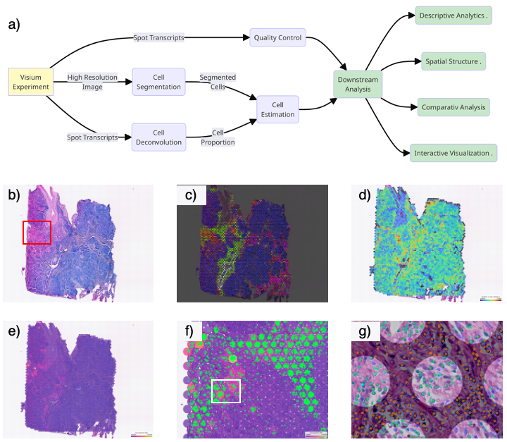

# SpatialOne: Spatial Transcriptomics at Scale
SpatialOne is an innovative tool designed to streamline the analysis of spatial transcriptomics data generated using platforms such as 10X Genomics Visium. By integrating both image and transcriptomics data, SpatialOne enables comprehensive analysis, combining state-of-the-art methods and pipelines to delve deeply into spatial data. This tool simplifies the complex process of analyzing spatial transcriptomics by offering an end-to-end solution that includes cell segmentation, deconvolution, and spatial structure analysis, ultimately generating detailed HTML reports. These results can be further explored using [TissUUmaps](https://tissuumaps.github.io/TissUUmaps-docs/), an open-source tool for visualizing spatial data.

**Key Features:**
SpatialOne leverages a modular approach to provide flexibility and extensibility in spatial transcriptomics analysis. Users can customize the analysis pipeline by selecting the most appropriate algorithms and parameters for each step. The workflow is designed to be user-friendly, with a low-code interface that allows researchers to produce robust and reproducible results without requiring advanced computational skills. SpatialOne is distributed as a Docker container, ensuring ease of installation and reproducibility across different computing environments. The tool generates comprehensive outputs, including HTML summary reports, CSV files, and AnnData files, which can be visualized interactively using [TissUUmaps](https://tissuumaps.github.io/TissUUmaps-docs/) or analyzed further with standard bioinformatics tools.

<div style="text-align: center;">
  
  <!---<p><em>SpatialOne uses SpaceRanger for expression processing and cell segmentation and cell deconvolution methods to determine cell types. Using the cell location estimation, it generates descriptive analytics, an HTML spatial structure report, compares regions of interest if provided, and displays results in the TissUUmaps interactive viewer</em></p>!-->
</div>

This repository contains the code and dockefiles to replicate results present in the paper - _"SpatialOne: End-to-End Analysis of Spatial Transcriptomics at Scale."_ It can be downloaded and run end-end spatial transcriptomics analysis on a local or remote machine (cloud agnostic). For reproducibility and distribution purposes SpatialOne is orchestrated via docker containers. This section provides details on how to run end-end spatial transcriptomics analysis on a local or remote machine (cloud agnostic) using docker.

- [System Requirements](#system-requirements)
- [Setup](#setup)
  - [Setup Input Data and Configurations](#1-setup-input-data-and-configurations)
    - [Setting up the analysis configuration](#setting-up-the-analysis-configuration)
    - [Input files for Spatial One](#input-files-for-spatial-one)
    - [Output files for Spatial One](#output-files-for-spatial-one)
  - [Set Up Environment](#2-set-up-environment)
  - [Building Docker Images](#3-building-docker-images)
- [Running Analysis with SpatialOne](#running-analysis-with-spatialone)
- [Visualizing Outputs in TissUUmaps](#visualizing-outputs-in-tisuumaps)

## System requirements

SpatialOne provides docker images for both AMD and ARM architectures. The compute requirements depends on the size of the input/experiment data being analyzed (i.e. resolution of microscopy image, size of reference single cell dataset).

With the exception of the Hovernet model, SpatialOne can run without a GPU where the cell segmentation (Cellpose) and cell deconvolution (CARD and Cell2Location) run with CPUs. However, the CPU-only approach will significantly increase the execution time. For GPU-based execution, we recommend running SpatialOne using a CUDA-compatible GPU. Lastly, some of the libraries used in SpatialOne rely on PyTorch, which does not ensure reproducibility between CPU and GPU executions. Hence, minor differences should be expected in the cell deconvolution results between CPU and GPU executions.

- **Hardware:**  16 CPU, 120GB RAM, 1 GPU, 100 GB (harddisk, depends on experiment size)

- **Software:** GPU (CUDA 11), Python 3.9

SpatialOne has been tested in the following systems:
- m5.12xlarge AWS EC2 instance with Amazon Linux 2 (Kernel-5.4)
- p3.8xlarge AWS EC2 GPU instance with Amazon Linux 2 (Kernel-5.4)
- Ubuntu 22.4 Linux Machine with a GPU
- Apple M2 Pro 16 GB Ventura.

Note that for Apple Silicon-based chips, such as the M1 and M2 processors, the docker-ARM image needs to be used. Tests in the Ubuntu and Apple M2 machines were realized with smaller datasets due to their memory limitations.

## Setup

Before running Spatial One, the following setup steps are required to ensure the pipelines find the paths to data and configs as needed:
1. Data Preparation
2. Environment setup
3. Building Docker images

### 1. Setup input data and configurations
Choose a single folder where all your data and configurations will stay, as well as future outputs. The following structure and file naming format should match **exactly** as below to ensure compliance with the main pipeline:

```
data/
├── conf/
│   └── visium_config_flow.yaml
├── prep/
│   ├── sample1/
│   │   └── #input files
│   └── sample2/
│       └── #input files
├── reference/
│   ├── # input reference data
│   ├── luca.h5ad
│   └── ...
└── results/
    └── #populated by the pipeline
```

We recommend placing the "data/" folder in the same level of directory as the spatialone-pipeline repository. The section below provides detailed information about each file/folder under the "data/" directory.

- **conf/visium_config_flow.yaml** - contains all configuration parameters such as sample_id, pipelines to run or specific run parameters. An example can be found under the conf/ folder of this repository.

- **prep/** - this is where all sample specific input data lies. Each folder within prep/ must correspond to a different experiment which contains the respective SpaceRanger outputs.

- **reference/** - this is where non-sample specific input data lies, for example, reference datasets or pre-trained models. Pipeline expects the following data to be present:

    -  reference atlas
    - cell signature files - (can be added automatically when retrain_cell_sig: True is set)
    - pre-trained model (if using Hovernet) - default model can be found [here for download](https://zenodo.org/records/10854151/files/hovernet_original_consep_type_tf2pytorch.tar?download=1)
    - label info (if using Hovernet) - default model can be found [here for download](https://zenodo.org/records/10854151/files/type_info.json?download=1)

#### **Setting up the analysis configuration:**
In order to configure the SpatialOne spatial analaysis, the user needs to define the configuration in a YAML file.
This file is usally place under **conf/visium_config_flow.yaml**.

In such file, the user needs to define the analysis metada, the pipeline modules that will be used, and the configuration parameters for each module.

- **Experiment Metadata**: Defines who set up the analysis, describes it, and defines the samples that will be analyzed. Each sample name should correspond to an independent subfolder under the **data/prep** directory.
```yaml user.id: "user@email.com" # for internal metadata handling
run.name: "Short name for the analysis"
run.description: "Description of the analysis"
run.summary: "Short Description fo the analyis"
experiment.ids: [
    # List of experiments to analyze
    # Experiment names must match folder names in 'prep' folder.
    # They will be analyzed concurrently using the same configuration params.
    "CytAssist_FFPE_Human_Lung_Squamous_Cell_Carcinoma",    # Experiment 1
    "CytAssist_11mm_FFPE_Human_Lung_Cancer"                 # Experiment 2
    ]
```

- **Pipeline Modules:** The different spatialone modules should be set to True or False.
```yaml pipelines.enabled:
    # Defines the pipelines to be executed
    # Note that there may be dependencies between pipelines, if basic pipelines like
    # celldeconv or imgseg are set to FALSE, the succeeding pipelines will only execute
    # if there are previous celldeconv or imgseg available in the results folder
    imgseg: True     # cell segmentation
    cell2spot: True  # matching cells to visium spots
    celldeconv: True # cell deconvoluiton
    cluster: True    # morphological clustering
    assign: True     # cell assignment integrates celldeconvolution with cell segmentation
    qc: True         # QC metrics generation
    datamerge: True  # To visualize in Tissuumaps enable "datamerge: true"
    spatialanalysis: True # Spatial analysis reporting
```

- **Module parameters:** For all the modules set to _True_, the user needs to define their individual parameters under a block corresponding to the module name.
A full list of each module parameter is available [here](docs_md/parameters.md); a config file example that can be used as template is available [here](conf/visium_config_flow.yaml)
```yaml
module_name_1: # For instance, imgseg
    model: # Select the implemented algorithm
        name: "algorithm_name" # e.g. Cellpose
        version: "2.1.1" # version tracking for retro-compatibility purposes
        params: # Full list of algoirthm parameters available at docs_md/parameters.md
            parameter_1: value
            parameter_2: value
            ... # Reduce the size of the image. Set this to 2 if your image is 40x
            parameter_n: value

module_name_2: # For instance, celldeconv
    model: # Select the implemented algorithm
        name: "algorithm_name" # e.g. cell2location
        version: "0.1.3" # version tracking for retro-compatibility purposes
        params: # Full list of algoirthm parameters available at docs_md/parameters.md
            parameter_1: value
            parameter_2: value
            ... # Reduce the size of the image. Set this to 2 if your image is 40x
            parameter_n: value
```

### **Input files for Spatial One:**

SpatialOne requires the following files, which can be obtained from SpaceRanger’s outputs for each experiment. These files must be stored in the prep folder within a subfolder named after the experiment ID. They must adhere **exactly** to the following naming convention:

- **raw_feature_bc_matrix.h5**
- **scalefactors_json.json**
- **tissue_hires_image.png**
- **tissue_lowres_image.png**
- **tissue_positions_list.csv**
- **wsi.tif:** _High-resolution image obtained from a microscope. Its resolution must be aligned to the scalefactors_json.json file._
- **gene_graph_clusters.csv**:
    - _CSV file containing the clustering results from the space ranger analysis. We recommend using the output of the graph-based clustering, but it also works with the results of K-means clustering analysis provided by SpaceRanger._
- **parameters.csv**:
    - _CSV file containing basic metadata on the experiment properties._
- **annotations.geojson** (optional): A geojson file defining regions of interest that will be analyzed by the pipeline.
- **web_summary**


### **Output files for Spatial One:**

This list describes the output files generated by SpatialOne. Depending on the analysis configuration, some of these files may not be present:

- **cell2location_results.csv / card_results.csv:** CSV file containing the estimated cell counts per spot.
- **cellpose_cell_segmentation_crop.npy / hovernet_cell_segmentation_crop:** numpy array containing the masks of all segmented cells.
- **cellpose_cell_segmentation_full.npy / hovernet_cell_segmentation_full.npy:** numpy array containing the masks of all segmented cells.
- **cells_adata.h5:** Anndata object containing all cell-related information (location, estimated cell type, barcode, etc.)
- **cells_df.csv:** CSV file containing the polygons defining the segmented cells, their center, and the spot they belong to (if any).
- **cells_layer.png**: PNG image with the contours of the segmented cells.
- **experiment_tmap.tmap**: TissUUmaps configuration file for results visualization.
-  **gene_qc.csv**: CSV file containing computed quality control metrics for each gene present in the original sample.
-  **merged_cells_df.csv**: CSV file containing cell information: location, spot it belongs to(if in spot), morphological cluster it belongs to (if any), and estimated cell type (if in spot)
- **merged_spots_df.csv**: CSV file containing spot information: location, associated barcode, number of cells identified in the spot, qc metrics, counts for each cell type identified in the deconvolution, gene expression levels for the genes specified in the data merge step
- **morphological_clusters.csv**: CSV file containing cell morphological features and results of cell morphological cluster step.
- **overall_qc.csv**: Aggregated quality control metrics for the whole sample.
- **piechart_df.csv:** CSV file containing cell proportions at each spot. Note that the cell proportions are obtained from the estimated cell counts and not from the raw deconvolution results.
- **reports**: Folder containing the spatial analysis HTML reports. report.html corresponds to the whole slide report, whilst regionX_report.html corresponds to annotation-specific regions.
- **run_configs.json**: summary of the analysis configuration
- **spot_qc.csv**: CSV file containing computed quality control metrics for each spot
- **spots_adata.h5**: Anndata object containing relevant spot information (location, cell counts, deconvolution results, gene expression, clustering results, qc results)
- **spots_df.csv**: CSV file containing the spot locations and the number of cells in each one.
- **spots_layer.png**: PNG image containing the spot locations for visualization purposes.

 ### 2. Set up environment

We need to update 2 environment variables before building the docker images for spatial one: **HOST_DATA_PATH**  and **GPU_DEVICE_ID**. The environment variables can be set in the ".env" file present in the repository, as shown below:

```
HOST_DATA_PATH = "/Users/<user_name>/Documents/SpatialOnePipeline/data/"
GPU_DEVICE_ID = 0
```

- **HOST_DATA_PATH**: This is the absolute path for where the data and configs will be stored for running Spatial One. Please ensure the path name convention above is followed exactly.
- **GPU_DEVICE_ID**: This defines the ID of the GPU that will be used to run the analysis (nvidia-smi command can help determine the device ID). For a single GPU, it is likely that the device ID is zero.

(Optional) In case you are using proxies, export them as environmental variables:

    export HTTP_PROXY="<proxy_values>"
    export HTTPS_PROXY="<proxy_values>"

### 3. Building Docker images

Docker compose is used to orchestrate the build and run of the required docker images for SpatialOne: main-pipeline, Card, Hovernet. To build all required docker images, run the following command:

    make docker-build

or (for cpu only machines)

**Disclaimer**: Hovernet image segmentation is not supported in this mode

    make docker-build-cpu

The docker build step can take up to 20 minutes and will need about 12-15 GB to store the docker images. Please adapt the "docker-compose.yml" or "docker-compose-cpu.yml" file(s) accordingly  if an ARM image is needed (i.e. Dockerfile_arm instead of Dockerfile or Dockerfile_amd)

## Running analysis with SpatialOne
Before runing the analysis, ensure that **HOST_DATA_PATH** and **GPU_DEVICE_ID** variables are set up appropriately in the ".env" file of the respository. The configurations under "_HOST_DATA_PATH/conf/visium_config_flow.yaml"_ will be used for running SpatialOne; please review the configurations before running the commmand below.

Run SpaitalOne using the following command:

    make docker-start

or (for cpu only machines)

    make docker-start-cpu

You will then see the progress logs in the terminal, and outputs will be produced to HOST_DATA_PATH/results/{sample_id}.

### Run light version of SpatialOne

The following commands can be used to run a light version of the spatialone pipeline (note: **CARD** or **Hovernet** are _**not**_ supported in this version). For GPU-enabled machines, use _"make run"_. Otherwise, use the command _"make run-cpu"_. Please ensure that the configurations are set correctly under "_HOST_DATA_PATH/conf/visium_config_flow.yaml"_ (celldeconv - cell2location only, imgseg - cellpose only).

      make build
      make run # gpu version
      make run-cpu # or, cpu only version

## Visualizing Outputs in TisUUmaps

To visualize SpatialOne outputs in TissUUmaps, follow these instructions:
1. Install TissUUmaps following its official [instructions](https://tissuumaps.github.io/installation/)
2. Run TissUUmaps

3. Load the .tmaps file saved at "<HOST_DATA_PATH>/results/experiment_name/experiment_tmap.tmap"
