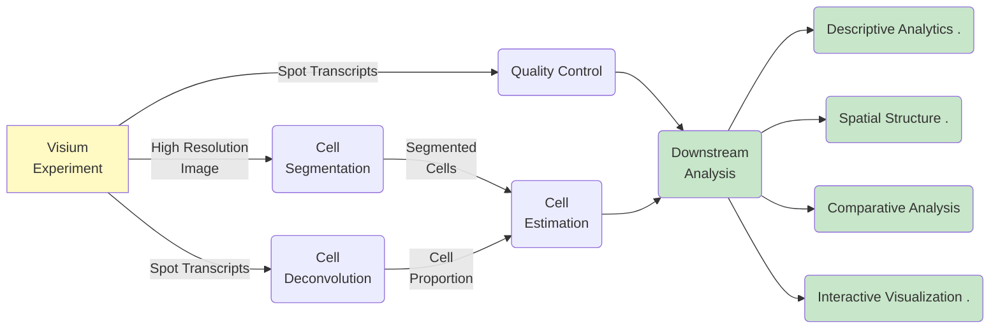

# Spatial One: Pipeline Parameters

This page lists the different parameters that can be used at each SpatialOne module.

### Parameters Index
- [Cell Segmentation](#cell-segmentation)
  - [Cellpose](#cellpose)
    - [Basic Parameters](#cellpose-basic-parameters)
    - [Advanced Parameters](#cellpose-advanced-parameters)
  - [Hovernet](#hovernet)
    - [Basic Parameters](#hovernet-basic-parameters)
    - [Advanced Parameters](#hovernet-advanced-parameters)
- [Cell Deconvolution](#cell-deconvolution)
  - [Cell2Location](#cell2location)
    - [Basic Parameters](#cell2location-basic-parameters)
    - [Advanced Parameters](#cell2location-advanced-parameters)
  - [CARD](#card)
    - [Basic Parameters](#card-basic-parameters)
    - [Advanced Parameters](#card-advanced-parameters)
- [Morphological Clustering](#morphological-clustering)
  - [K-means](#k-means)
    - [Basic Parameters](#k-means-basic-parameters)
    - [Advanced Parameters](#k-means-advanced-parameters)
  - [Gaussian Clustering](#gaussian-clustering)
    - [Basic Parameters](#gaussian-clustering-basic-parameters)
- [Quality Control](#quality-control)
  - [Basic Parameters](#quality-control-basic-parameters)
  - [Advanced Parameters](#quality-control-advanced-parameters)
- [Datamerge](#datamerge)
  - [Basic Parameters](#datamerge-basic-parameters)
  - [Advanced Parameters](#datamerge-advanced-parameters)
- [Spatial Structure Analysis](#spatial-structure-analysis)
  - [Whole Tissue Analysis](#whole-tissue-analysis)
    - [Basic Parameters](#whole-tissue-analysis-basic-parameters)
    - [Advanced Parameters](#whole-tissue-analysis-advanced-parameters)
  - [Region Analysis](#region-analysis)
    - [Basic Parameters](#region-analysis-basic-parameters)
    - [Advanced Parameters](#region-analysis-advanced-parameters)

## Cell Segmentation  
SpatialOne's cell segmentation module implements Cellpose and Hovernet.
### Cellpose
Cellpose is a generalist, deep learning-based cell segmentation algorithm designed to accurately identify and segment cells in microscopy images. SpatialOne uses the nuclei model for its analysis. To set it up make sure to provide the adjust the downsample_factor to align with the magnification of your images.

Please refer to the official [documentation](https://cellpose.readthedocs.io/en/latest/models.html) for additional details.

#### Basic Parameters
| Parameter         | Description                                                                                                                        |
| ----------------- | ---------------------------------------------------------------------------------------------------------------------------------- |
| downsample_factor | Factor to downsample the image. Use a value of 2 for 40X images to match the 20X image training set.                                |
| diameter          | Expected average cell size in pixels. A value of 0 allows the model to estimate cell size automatically.                            |
[Back to index⬆️](#parameters-index)
#### Advanced Parameters
| Parameter      | Description                                                                                                                                                                                                                                                                                                                                                                                                |
| -------------- | ---------------------------------------------------------------------------------------------------------------------------------------------------------------------------------------------------------------------------------------------------------------------------------------------------------------------------------------------------------------------------------------------------------- |
| batch_size     | Number of tiles that will be simultaneously processed.                                                                                                                                                                                                                                                                                                                                                       |
| flow_threshold | Determines the aggressiveness of segmentation. Low values (e.g. 0.4) result in fewer segmented cells with high confidence, while high values (e.g. 0.8) result in more segmented cells with a higher risk of false positives.                                                                                                                                                                               |
| model_type     | Specifies if the model should segment nuclei or cytoplasm.                                                                                                                                                                                                                                                                                                                                                   |
| n_channels     | Determines which channels will be used to segment the cells: \- 0,0: all channels \- 1,0: blue channel \- 2,0: green channel \- 3,0: red channel                                                                                                                                                                                                                                             |
| overlay        | Defines if tiles should overlap at the edges, ensuring cells on the border of a tile are also segmented.                                                                                                                                                                                                                                                                                                     |
| patch_size     | Size of the tiles the image will be broken into for analysis.                                                                                                                                                                                                                                                                                                                                               |
[Back to index⬆️](#parameters-index)
### Hovernet
Hovernet is a deep learning-based cell segmentation algorithm designed to simultaneously segment and classify nuclei in histopathology images. SpatialOne uses the Hovernet model for its segmentation analysis but does not use the classification capabiliteis. SpatialOne relies on the Consep-trainned version of HoverNet. PanNvke-trained version of Hovernet provides better performance than Consep but it is not included in SpatialOne due to the dataset having a more restrictive license.

The user does not need to set up any basic parameter for running Hovernet. Please refer to the official [github repository](https://github.com/vqdang/hover_net) for additional details.

#### Advanced Parameters
| Parameter             | Description                                                                                                            |
| -------------------- | ---------------------------------------------------------------------------------------------------------------------- |
| gpu                  | Determines whether to use GPU for processing.                                                                           |
| help                 | Provides help or documentation for using Hovernet.                                                                      |
| nr_inference_workers | Number of workers for inference processing.                                                                             |
| nr_post_proc_workers | Number of workers for post-processing tasks.                                                                            |
| tile                 | Size of the tile used for processing.                                                                                   |
| wsi                  | Option for whole slide image processing.                                                                                |
| batch_size | Number of tiles that will be simultaneously processed.                                                      |
| model_mode | Hovernet model to use (fast or original).                                                                   |
| nr_types   | Number of expected nuclear types. Use 5 if uncertain.                                                       |
[Back to index⬆️](#parameters-index)
## Cell Deconvolution
SpatialOne can deconvolute cells using Cell2Location and CARD.

### Cell2Location
Cell2Location is a probabilistic cell deconvolution algorithm that uses single-cell RNA sequencing data to map cell types in spatial transcriptomics data. To set it up, make sure to define an appropriate appropriate single cell reference dataset so the spatial data expression profiles can be compared with individual sc-gene expression profiles. 

Please refer to the official [documentation](https://cell2location.readthedocs.io/en/latest/) for additional details.

#### Basic Parameters
| Parameter    | Description                                                                                                                                                                                                                                                                                                                                                  |
| ------------ | ---------------------------- |
| atlas_type   | Defines the single-cell dataset that will be used as a reference for deconvolution. This parameter is crucial as the deconvolution will consider only cell types present in the atlas. Select a reference atlas according to the organ, tissue type, and species you are analyzing.                                                                         |
| mode         | Mode of operation for the Cell2Location algorithm.                                                                                                                                                                                                                                                                                                           |
[Back to index⬆️](#parameters-index)
#### Advanced Parameters
| Parameter                  | Description                                                                                                                                                                                                                                                                                                                                                     |
| -------------------------- | --------------------------------------------------------------------------------------------------------------------------------------------------------------------------------------------------------------------------------------------------------------------------------------------------------------------------------------------------------------- |
| cell_abundance_threshold   | If a spot has a low abundance of a given cell type (less than cell_abundance_threshold), that cell type will be excluded from the spot analysis. This parameter helps reduce noise in the output.                                                                                                                                                              |
| retrain_cell_sig           | Forces retraining the cell deconvolution model even if a model has been previously created. This will likely slow down your analysis but will ensure the most recent reference data is being used.                                                                                                                                                              |
| sc_batch_key               | Column storing the batch information in the single-cell reference dataset.                                                                                                                                                                                                                                                                                      |
| sc_categorical_covariate_keys | Specifies multiplicative technical effects (e.g., platform, 3' vs 5', donor effect).                                                                                                                                                                                                                                                                            |
| sc_cell_count_cutoff       | Determines the minimum number of cells in which a gene must be identified in the reference data to be considered in the analysis. Higher values may improve the confidence of the deconvolution but also increase the risk of cells not being identified.                                                                                                       |
| sc_cell_percentage_cutoff2 | Determines the minimum percentage of cells in the reference data in which a gene must be identified to be considered in the analysis. Higher values may improve the confidence of the deconvolution but also increase the risk of cells not being identified.                                                                                                    |
| sc_label_key               | Column storing the label information in the single-cell reference dataset.                                                                                                                                                                                                                                                                                       |
| sc_lr                      | Learning rate used to create a model from the single-cell reference data. Increasing the learning rate may increase the training speed but may also result in unstable models.                                                                                                                                                                                   |
| sc_max_epochs              | Maximum number of epochs used to create a model from the single-cell reference data. Higher numbers may result in a more accurate model but with the risk of overfitting.                                                                                                                                                                                        |
| sc_nonz_mean_cutoff        | Minimum mean expression that a gene must present within cells in the reference dataset. Authors recommend this value to be slightly greater than 1.                                                                                                                                                                                                              |
| sc_use_gpu                 | Determines if cell deconvolution will run on a GPU.                                                                                                                                                                                                                                                                                                               |
| st_N_cells_per_location    | Expected average number of cells present at each spot. Providing an accurate estimate will help the deconvolution method provide a more reliable outcome.                                                                                                                                                                                                         |
| st_detection_alpha         | Hyperparameter controlling normalization of within-experiment variation in RNA detection.                                                                                                                                                                                                                                                                         |
| st_max_epochs              | Maximum number of epochs used to create a model from the single-cell reference data. Higher numbers may result in a more accurate model but with the risk of overfitting.                                                                                                                                                                                        |
[Back to index⬆️](#parameters-index)
### CARD
CARD (Cellular Analysis of Regulatory DNA) is an algorithm for deconvoluting cell types in spatial transcriptomics data using reference single-cell RNA sequencing data. To set it up in SpatialOne, make sure to define an appropriate single cell reference dataset.

For more details about its configuration please refere to the original [github repository](https://github.com/YMa-lab/CARD)

#### Basic Parameters
| Parameter    | Description |
| ------------ | ----------------- |
| atlas_type   | Defines the single-cell dataset that will be used as a reference for deconvolution. This parameter is crucial as the deconvolution will consider only cell types present in the atlas. Select a reference atlas according to the organ, tissue type, and species you are analyzing.                                                                         |
| mode         | Mode of operation for the CARD algorithm.                                                                                                                                                                                                                                                                                                                   |
[Back to index⬆️](#parameters-index)
#### Advanced Parameters
| Parameter        | Description                                                                                                                                                                                                                                                                                                                                                              |
| ---------------- | ---------- |
| ct_select        | Vector of cell type names that you are interested in deconvoluting. If no value is provided, all cells in the reference dataset will be considered.                                                                                                                                                                                                                     |
| ct_varname       | Name of the column in sc_meta that specifies the cell type assignment.                                                                                                                                                                                                                                                                                                  |
| min_count_gene   | Defines the minimum number of counts a spatial location needs to be included in the analysis.                                                                                                                                                                                                                                                                           |
| min_count_spot   | Defines the minimum number of spots a gene should have non-zero expression in to be included in the analysis.                                                                                                                                                                                                                                                            |
| sc_label_key     | Column storing the label information in the single-cell reference dataset.                                                                                                                                                                                                                                                                                              |
| sc_sample_key    | Column storing the batch information in the single-cell reference dataset.                                                                                                                                                                                                                                                                                              |

[Back to index⬆️](#parameters-index)
## Morphological Clustering
SpatialOne can cluster cells based on their morphology using Batch K-means and Gaussian Clustering.

### K-means

#### Basic Parameters
| Parameter      | Description,|
| -------------- | ------- |
| n_clusters     | Number of groups into which the data will be divided.                                                                 |
| spot_clustering | Select this checkbox to improve cell assignment by using clustering information.                                       |
[Back to index⬆️](#parameters-index)
#### Advanced Parameters
| Parameter         | Description                                                                                                          |
| ----------------- | ----- |
| clustering_batch_size | Data will be partitioned to use memory efficiently. Use this parameter to define the size of the data partition. |
[Back to index⬆️](#parameters-index)
### Gaussian Clustering

#### Basic Parameters
| Parameter      | Description                                                                                                             |
| -------------- | --------------- |
| n_clusters     | Number of groups into which the data will be divided.                                                                 |
| spot_clustering | Select this checkbox to improve cell assignment by using clustering information.                                       |
[Back to index⬆️](#parameters-index)
## Quality Control
For QC analysis, only information regarding mitochondrial gene filtering is required.

### Basic Parameters
| Parameter         | Description                                                                                         |
| ----------------- | ----------- |
| label             | String label used to indicate filtered genes (default: "qc_mitochondrial_genes").                   |
[Back to index⬆️](#parameters-index)
### Advanced Parameters
| Parameter         | Description                                                                                         |
| ----------------- | --------------------- |
| list_of_gene_ids  | Genes in the list will be filtered as mitochondrial genes.                                          |
| start_with        | Genes starting with the following string will be filtered as mitochondrial genes (default: "-MT"). |
[Back to index⬆️](#parameters-index)
## Datamerge
The datamerge step determines how the data generated during the segmentation, deconvolution and cell estimation steps will be aggregated. The downstream analysis will only use the genes defined on the basic parameters.

#### Basic Parameters
| Parameter               | Description                                                                                                     |
| ----------------------- | ----------- |
| n_top_expressed_genes   | Number of top expressed genes to include in the reporting. Default is 500.                                      |
| n_top_variability_genes | Number of top variability genes to include in the reporting. Default is 500.                                    |
| target_genes            | List of specific genes to include in the analysis regardless of their expression levels. Default is an empty list. |
[Back to index⬆️](#parameters-index)
#### Advanced Parameters
| Parameter              | Description                                                                                                     |
| ---------------------- | --------------------------------------------------------------------------------------------------------------- |
| cell_index             | Column defining the cell index. Default is "cell_ids".                                                          |
| cells_df_cols_omit     | List of columns to omit from the cells_df. Default is ["cell_polygons"].                                        |
| spot_index             | Column defining the spot index. Default is "barcode".                                                           |
| spots_df_cols_omit     | List of columns to omit from spots_df. Default is ["in_tissue", "spot_polygons", "array_col", "array_row"].     |
[Back to index⬆️](#parameters-index)
## Spatial Structure Analysis
The following sections set up which analysis will be conducted at each section of the spatial structure analysis.

### Whole Tissue Analysis

#### Basic Parameters
| Parameter                   | Description                                                                                             |
| --------------------------- | ------------------------------------------------------------------------------------------------------- |
| cell_cooccur                | Estimates the probability of cell co-occurrence within a given distance.                                 |
| cell_counts                 | Bar plot summarizing cell counts in the slide.                                                           |
| cell_net_chord              | Neighborhood Enrichment Analysis - Z-Score Clustergram. Quantifies co-localization of pairs of cells.   |
| cell_net_matrix             | Neighborhood Enrichment Analysis - Z-Score Clustergram. Quantifies co-localization of pairs of cells.   |
| cell_per_spot               | Boxplot visualization of cell abundance at spot level.                                                  |
| cell_summary                | Table summarizing cell counts in the slide.                                                             |
| diff_exp_annotations        | Performs differential expression analysis between annotated regions (if provided).                      |
| diff_exp_clusters           | Performs differential expression analysis between different spot clusters.                              |
| infilt_comparing_cell_types | Analyzes infiltration levels of the cell within and outside the analyzed region.                        |
| infilt_comparing_levels     | Analyzes infiltration levels of the cell within and outside the analyzed region.                        |
| morans_cell_heatmap         | Heatmap showing Moran's I statistic at cell level. Moran's I computes cell autocorrelation.             |
| morans_gene_heatmap         | Heatmap showing Moran's I statistic at gene level. Moran's I computes gene autocorrelation.             |
| morans_cell_bar             | Barplot showing highest Moran's I statistic at cell level. Moran's I computes cell autocorrelation.     |
| morans_gene_bar             | Barplot showing highest Moran's I statistic at gene level. Moran's I computes gene autocorrelation.     |
| qc_report                   | Includes the Space Ranger QC report in the resulting HTML.                                              |
| spot_avg_gene_counts        | Bar plot summarizing average gene expression per spot.                                                  |
| spot_diff_exp               | Differential expression analysis between spots.                                                         |
[Back to index⬆️](#parameters-index)
#### Advanced Parameters
| Parameter                 | Description                                                                                                              |
| ------------------------- | ------------------------------------------------------------------------------------------------------------------------ |
| chord_n_cells             | Minimum number of cell types required to generate a chord plot.                                                          |
| diff_fc_thresh            | Fold change threshold to use for gene comparative analysis.                                                              |
| diff_pval                 | Significance level to use for gene comparative analysis.                                                                 |
| infilt_levels             | Number of levels to consider for infiltration analysis.                                                                  |
| moran_pval                | Significance level to use for Moran's I.                                                                                  |
| n_cells_neighbors         | Minimum number of cells to build a neighbors NER graph.                                                                  |
| n_cols                    | Number of columns in the grid of Moran plots.                                                                             |
| n_genes_bar               | Number of top genes to visualize on Moran's I bar plot.                                                                  |
| n_genes_exp               | Number of top genes to visualize after Moran's analysis.                                                                 |
| n_intervals               | Distance intervals at which co-occurrence is computed.                                                                   |
| n_neighs                  | Number of neighboring tiles when coord_type is "grid". Number of neighborhoods for non-grid data when coord_type is "generic". |
| n_perms                   | Number of permutations for Moran's I. Increasing the number of permutations will increase processing time.               |
| n_rings                   | Number of rings of neighbors for grid data.                                                                              |
| n_splits                  | Number of splits in which to divide the spatial coordinates for co-occurrence analysis.                                   |
| net_cutoff                | Cutoff for considering an interaction from neighborhood enrichment analysis.                                             |
[Back to index⬆️](#parameters-index)
### Region Analysis

#### Basic Parameters
| Parameter                   | Description                                                                                             |
| --------------------------- | ------------------------------------------------------------------------------------------------------- |
| cell_cooccur                | Estimates the probability of cell co-occurrence within a given distance.                                 |
| cell_counts                 | Bar plot summarizing cell counts in the slide.                                                           |
| cell_net_chord              | Neighborhood Enrichment Analysis - Z-Score Clustergram. Quantifies co-localization of pairs of cells.   |
| cell_net_matrix             | Neighborhood Enrichment Analysis - Z-Score Clustergram. Quantifies co-localization of pairs of cells.   |
| cell_per_spot               | Boxplot visualization of cell abundance at spot level.                                                  |
| cell_summary                | Table summarizing cell counts in the slide.                                                             |
| diff_exp_annotations        | Performs differential expression analysis between annotated regions (if provided).                      |
| diff_exp_clusters           | Performs differential expression analysis between different spot clusters.                              |
| infilt_comparing_cell_types | Analyzes infiltration levels of the cell within and outside the analyzed region.                        |
| infilt_comparing_levels     | Analyzes infiltration levels of the cell within and outside the analyzed region.                        |
| morans_cell_heatmap         | Heatmap showing Moran's I statistic at cell level. Moran's I computes cell autocorrelation.             |
| morans_gene_heatmap         | Heatmap showing Moran's I statistic at gene level. Moran's I computes gene autocorrelation.             |
| morans_cell_bar             | Barplot showing highest Moran's I statistic at cell level. Moran's I computes cell autocorrelation.     |
| morans_gene_bar             | Barplot showing highest Moran's I statistic at gene level. Moran's I computes gene autocorrelation.     |
| qc_report                   | Includes the Space Ranger QC report in the resulting HTML.                                              |
| spot_avg_gene_counts        | Bar plot summarizing average gene expression per spot.                                                  |
| spot_diff_exp               | Differential expression analysis between spots.                                                         |
[Back to index⬆️](#parameters-index)
#### Advanced Parameters
| Parameter                 | Description                                                                                                              |
| ------------------------- | ------------------------------------------------------------------------------------------------------------------------ |
| chord_n_cells             | Minimum number of cell types required to generate a chord plot.                                                          |
| diff_fc_thresh            | Fold change threshold to use for gene comparative analysis.                                                              |
| diff_pval                 | Significance level to use for gene comparative analysis.                                                                 |
| infilt_levels             | Number of levels to consider for infiltration analysis.                                                                  |
| moran_pval                | Significance level to use for Moran's I.                                                                                  |
| n_cells_neighbors         | Minimum number of cells to build a neighbors NER graph.                                                                  |
| n_cols                    | Number of columns in the grid of Moran plots.                                                                             |
| n_genes_bar               | Number of top genes to visualize on Moran's I bar plot.                                                                  |
| n_genes_exp               | Number of top genes to visualize after Moran's analysis.                                                                 |
| n_intervals               | Distance intervals at which co-occurrence is computed.                                                                   |
| n_neighs                  | Number of neighboring tiles when coord_type is "grid". Number of neighborhoods for non-grid data when coord_type is "generic". |
| n_perms                   | Number of permutations for Moran's I. Increasing the number of permutations will increase processing time.               |
| n_rings                   | Number of rings of neighbors for grid data.                                                                              |
| n_splits                  | Number of splits in which to divide the spatial coordinates for co-occurrence analysis.                                   |
| net_cutoff                | Cutoff for considering an interaction from neighborhood enrichment analysis.                                             |
[Back to index⬆️](#parameters-index)